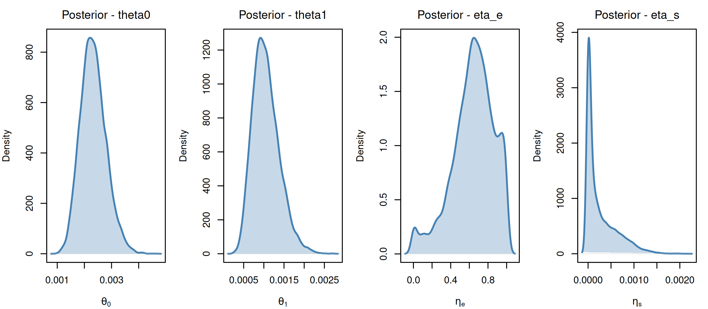
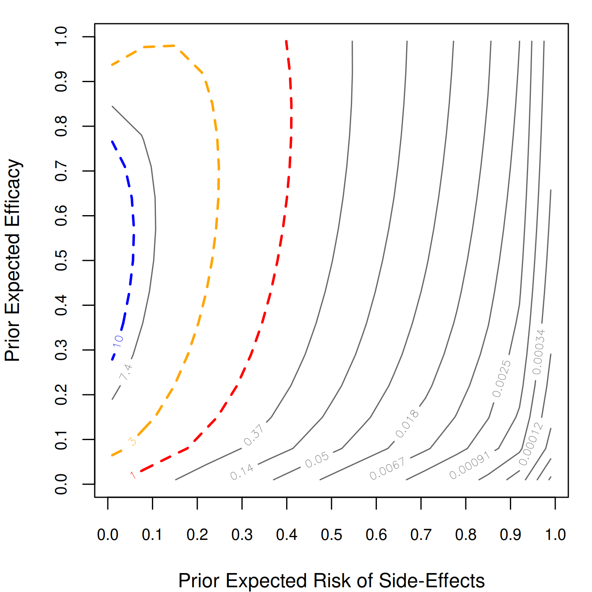

<!-- README.md is generated from README.Rmd. Please edit that file -->

# brease: Causally Sound Priors for Binary Experiments

<!-- badges: start -->

[](https://github.com/carloscinelli/brease/actions/workflows/R-CMD-check.yaml)
<!-- badges: end -->

The `brease` R package implements the **BREASE** (**B**aseline **R**isk,
**E**fficacy, and **A**dverse **S**ide **E**ffects) framework for
Bayesian analysis of randomized controlled trials with binary treatment
and binary outcome, as described in:

> Irons, N.J. and Cinelli, C. (2025). [Causally Sound Priors for Binary
> Experiments](https://doi.org/10.1214/25-BA1506). *Bayesian Analysis*.

## Installation

You can install the development version from GitHub:

``` r
# install.packages("devtools")
devtools::install_github("carloscinelli/brease")
```

## Basic Usage

``` r
# loads package
library(brease)
#> brease: Causally Sound Priors for Binary Experiments
#> Details: Irons and Cinelli (2025). Bayesian Analysis.
#>          https://doi.org/10.1214/25-BA1506

# loads data
data("aspirin")

# Aspirin and Myocardial Infarction (Physicians' Health Study)
# 26 MIs in control (N = 11,034), 10 MIs in treatment (N = 11,037)
result <- brease(y0 = aspirin$y0, y1 = aspirin$y1,
                 N0 = aspirin$N0, N1 = aspirin$N1)
result
#> Bayesian Analysis of Binary Experiment
#> Method: BREASE 
#> 
#> Data:
#>   Control:   y0 = 26, N0 = 11034 (rate = 0.0024)
#>   Treatment: y1 = 10, N1 = 11037 (rate = 0.0009)
#> 
#> Prior:
#>   theta0 ~ Beta(1.00, 1.00)  [mu0 = 0.50, n0 = 2.0]
#>   eta_e  ~ Beta(0.30, 0.70)  [mue = 0.30, ne = 1.0]
#>   eta_s  ~ Beta(0.30, 0.70)  [mus = 0.30, ns = 1.0]
#> 
#> Posterior Summaries:
#>   Baseline Risk (theta0)        Mean: 0.00233  [0.00149, 0.00334]
#>   Treatment Risk (theta1)       Mean: 0.00105  [0.00052, 0.0018]
#>   Risk Ratio (RR)               Mean: 0.475  [0.203, 0.966]
#>   Efficacy Fraction (EF)        Mean: 0.525  [0.034, 0.797]
#>   Odds Ratio (OR)               Mean: 0.474  [0.202, 0.966]
#>   Risk Difference (RD)          Mean: -0.00127  [-0.00243, -5.45e-05]
#> 
#> Bayes Factor (BF10): 1.21
#> Bayes Factor (BF01): 0.823
```

``` r
summary(result)
#> Posterior Summaries:
#> 
#>            mean      med       lw       up
#> theta0  0.00233  0.00230  0.00149  0.00334
#> theta1  0.00105  0.00102  0.00052  0.00180
#> eta_e   0.63991  0.65899  0.08731  0.98633
#> eta_s   0.00026  0.00010  0.00000  0.00112
#> rr      0.47455  0.43954  0.20299  0.96603
#> ef      0.52545  0.56046  0.03397  0.79701
#> or      0.47405  0.43892  0.20250  0.96598
#> rd     -0.00127 -0.00128 -0.00243 -0.00005
#> 
#> Bayes Factor BF10 = 1.2148
#> Bayes Factor BF01 = 0.8232
```

### Posterior Plots

``` r
plot(result, which = c("theta0", "theta1", "eta_e", "eta_s"))
```



### Sensitivity Analysis

We can examine how the Bayes factor changes across different prior
specifications using contour plots:

``` r
sens <- bf_seq(y0 = aspirin$y0, y1 = aspirin$y1,
               N0 = aspirin$N0, N1 = aspirin$N1,
               mus_seq = seq(0.01, 0.99, length = 15),
               mue_seq = seq(0.01, 0.99, length = 15))
contour_bf(sens)
```



## Overview

The BREASE framework parameterizes the likelihood of a binary experiment
in terms of three clinically meaningful causal quantities:

- **Baseline risk** ($\theta_0$): probability of the event without
  treatment
- **Efficacy** ($\eta_e$): fraction of would-be cases prevented by
  treatment
- **Side-effect risk** ($\eta_s$): fraction of would-be non-cases harmed
  by treatment

The package provides:

- **Exact posterior sampling** and analytic marginal likelihoods/Bayes
  factors
- **Optional MCMC backends** via Stan or JAGS
- **Sensitivity analysis** tools (contour plots, side-effect
  sensitivity)
- **Comparison methods**: Independent Beta and Logit-Transform priors
- **Bounds** on probabilities of causation

## Documentation

For a detailed introduction, see the [package
vignette](https://carloscinelli.com/brease/articles/brease.html).

## Citation

If you use this package, please cite:

    Irons, N.J. and Cinelli, C. (2025). Causally Sound Priors for Binary
    Experiments. Bayesian Analysis. doi:10.1214/25-BA1506
